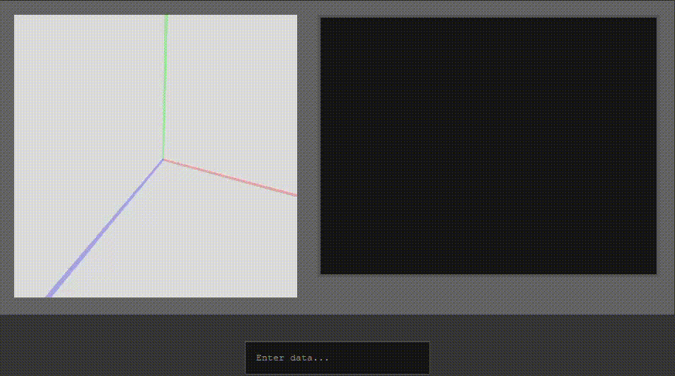
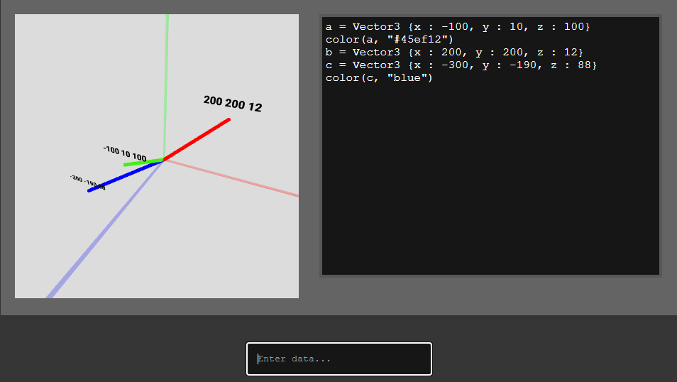
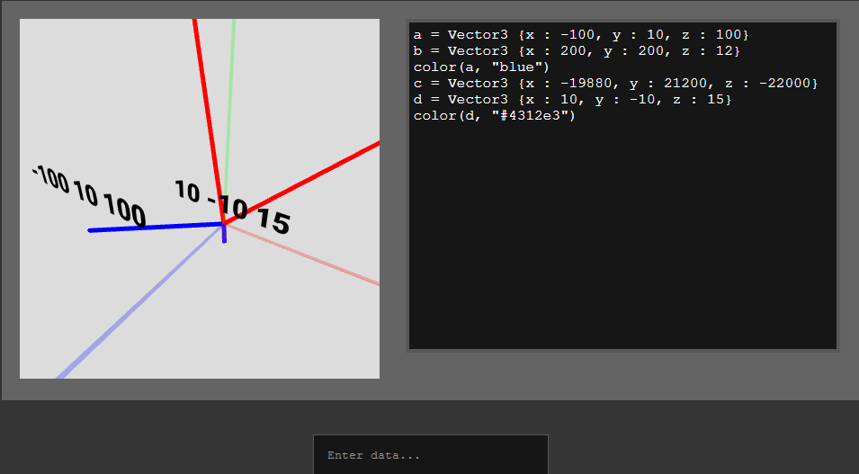
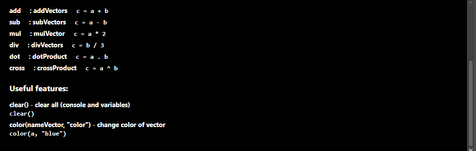

# Vector Interpreter (p5.js WebGL)

This project is a lightweight interactive vector math interpreter built with **p5.js (WebGL)**. It allows users to define, manipulate, and visualize 3D vectors in real time using a simple custom scripting syntax.

---

## ✨ Features

- Create 3D vectors using `vec3(x, y, z)`
- Vector operations:
  - Addition: `a + b`
  - Subtraction: `a - b`
  - Scalar multiplication: `a * 2`
  - Scalar division: `a / 2`
  - Cross product: `a ^ b`
  - Dot product: `a . b`

- Real-time 3D visualization (WebGL)
- Interactive camera controls (`orbitControl`)
- Command history (arrow keys)
- Console-style output system
- Variable system with live updates
- Utility commands:
  - `clear()` → reset environment
  - `color(a, "red")` → change vector color (also work on hex for example `color(b, "#4287f5")`)

---

## 🧠 Purpose

This project was created as a learning tool for:

- Building a custom expression interpreter (DSL)
- Understanding 3D vector math
- Working with WebGL in p5.js
- Parsing and evaluating expressions in real time

---

## 🎬 Demo









---

## 🛠 Tech Stack

- JavaScript (ES6)
- p5.js (WebGL mode)
- Custom parser / interpreter

---

## 📁 Example usage

```txt
a = vec3(1, 2, 3)
b = vec3(4, 5, 6)

c = a + b
d = a - b
e = a ^ b
f = a . b
